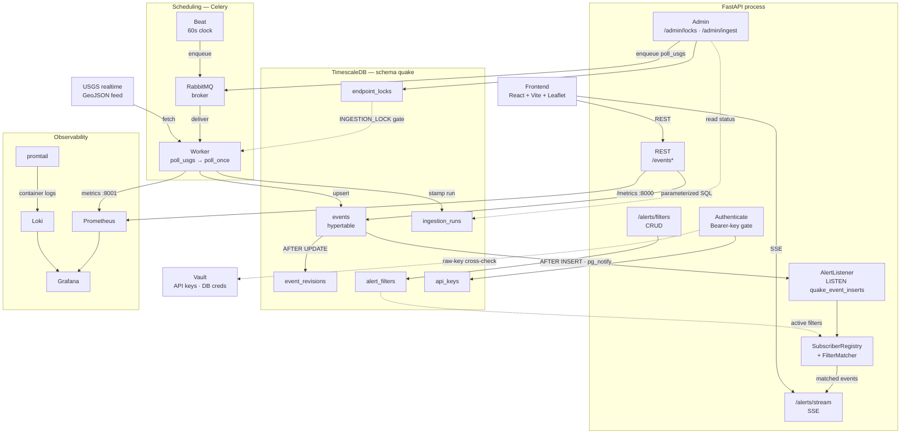

# Architecture — components & data flow

`quake-feed` is a layered service: a Celery worker ingests the USGS realtime
feed into TimescaleDB on a 60-second cadence, a FastAPI process serves that data
over REST and pushes new events over SSE, a React/Leaflet SPA consumes both, and
Vault + Prometheus/Grafana/Loki sit alongside for secrets and observability. The
whole thing runs locally under one `docker-compose`.

This document covers (a) the component map, then the three data flows that
matter: (b) the **ingestion path** (write), (c) the **read path** (REST), and
(d) the **alert path** (SSE). Each subsystem has its own deep-dive — see the hub
at the bottom.

## Component map

Every protected endpoint (`/events*`, the admin surface, `/alerts/*`) resolves
the `Authenticate` dependency first: it hashes the `Authorization: Bearer <key>`
header, looks the hash up in `quake.api_keys`, cross-checks the raw key against
Vault, and gates admin routes on the `admin` scope. The `AUTH` node above shows
those validation backends rather than drawing an edge from every endpoint.

## Ingestion path (write)

How a USGS reading becomes a stored event — driven entirely by the Celery
worker, no HTTP involved.

1. **Beat enqueues.** Celery Beat puts `quake.tasks.poll_usgs` on the RabbitMQ
   broker every 60 seconds. (The admin endpoint `/admin/ingest/trigger` enqueues
   the same task on demand via `celery_app.send_task`.)
2. **Worker runs `poll_once`.** The worker consumes the task and calls
   `quake.events.ingest.poll_once`. First it checks the `INGESTION_LOCK` flag in
   `quake.endpoint_locks`; if set, it records a *skipped* run and returns without
   touching USGS.
3. **Fetch → parse.** `UsgsClient.fetch` pulls the GeoJSON feed (retries/backoff
   live in the client); `parse_feed` turns it into internal event models.
4. **Upsert.** `EventsETL.upsert_many` writes the batch into the
   `quake.events` hypertable, `UPSERT`-ing on the `(event_id, time)` primary key.
   A brand-new event is an **INSERT**; a refined reading for an existing key is
   an **UPDATE**.
5. **Triggers fire.** Two DB triggers on `quake.events` do the rest:
   - `AFTER UPDATE` → the **revision trigger** writes a `quake.event_revisions`
     row when magnitude/depth/place crosses the noise threshold (USGS refines
     estimates after the initial report; this preserves the audit trail).
   - `AFTER INSERT` → the **notify trigger** fires `pg_notify` on the
     `quake_event_inserts` channel (this is what feeds the alert path below).
6. **Stamp the run.** `IngestionRunsETL` finalizes a `quake.ingestion_runs` row
   with inserted/updated/revision counts (or an error), and the Prometheus
   ingestion counters are incremented.

Deep dives: [`docs/task-scheduler.md`](task-scheduler.md) (scheduling) and
[`docs/database-migrations.md`](database-migrations.md) (schema + triggers).

## Read path (REST)

How a client query becomes JSON.

1. **Request + auth.** A client calls `GET /events/recent`, `GET /events?near=…`,
   etc. with a Bearer key. FastAPI resolves the `Authenticate` dependency before
   the endpoint body runs.
2. **Manager → Views.** The request lands on `EventsManager`'s router, which
   delegates to the `Views` holding the endpoint logic (the repo-wide
   Manager/Views pattern).
3. **Query.** `EventsETL.query()` runs parameterized SQL against `quake.events`
   — combined filters for time window, magnitude floor, and proximity
   (`near=lat,lon` + `radius_km`).
4. **DTO out.** Rows map to the `EventResponse` Pydantic model and serialize to
   JSON. Times cross the API boundary as UTC `TIMESTAMPTZ`.

## Alert path (SSE)

How a freshly-inserted event reaches a connected browser in real time. This is
**in-process pub/sub, single-pod by design** — no broker fanout.

1. **NOTIFY.** The `AFTER INSERT` notify trigger (ingestion path, step 5) emits
   `pg_notify('quake_event_inserts', row_to_json(NEW))`.
2. **Listener.** Inside the FastAPI process, `AlertListener` (a lifespan-managed
   asyncio task holding one autocommit `LISTEN` connection) receives the
   notification, decodes the payload into an `EventRow`, and publishes it to the
   in-process `SubscriberRegistry`.
3. **Match + fan-out.** The registry holds each connected client's active
   filter; `FilterMatcher` tests the event against every subscriber's
   `AlertFilter` (min magnitude, bbox **XOR** center+radius) and routes it only
   to those it matches.
4. **SSE.** Matching events are pushed down each client's `/alerts/stream`
   Server-Sent Events connection (`sse-starlette`). Filters are persisted
   per-key in `quake.alert_filters` via `/alerts/filters` CRUD and loaded when a
   client connects.

Because the listener and registry live in the API process, this works for one
backend pod only. Scaling past one pod would require moving the publish step
behind a broker — the [`docs/alerts.md`](alerts.md) deep-dive covers the limit
and its migration path.

## Process & deployment shape

One Docker image runs the backend, the Celery worker, and Celery Beat — they
differ only by command. Stateful services (TimescaleDB, RabbitMQ, Vault) and the
observability stack (Prometheus, Loki, promtail, Grafana) are separate
containers on the `quake_platform` network. Prometheus scrapes two targets —
`backend:8000` (`/metrics`) and `celery_worker:8001` — because
`prometheus_client` registries are per-process; Grafana reads Prometheus and
Loki only (no direct DB datasource). All of it comes up with `make up`.

## Subsystem deep-dives

| Topic | Document |
|-------|----------|
| Database schema & dbmate migrations | [`docs/database-migrations.md`](database-migrations.md) |
| Task scheduler (Celery + RabbitMQ + Beat) | [`docs/task-scheduler.md`](task-scheduler.md) |
| Alerts SSE (in-process pub/sub, filter matcher) | [`docs/alerts.md`](alerts.md) |
| Observability (metrics, dashboard, logs) | [`docs/observability.md`](observability.md) |
| HashiCorp Vault (lifecycle, secret layout) | [`docs/vault.md`](vault.md) |
| Frontend (React + Vite + Leaflet) | [`docs/frontend.md`](frontend.md) |
